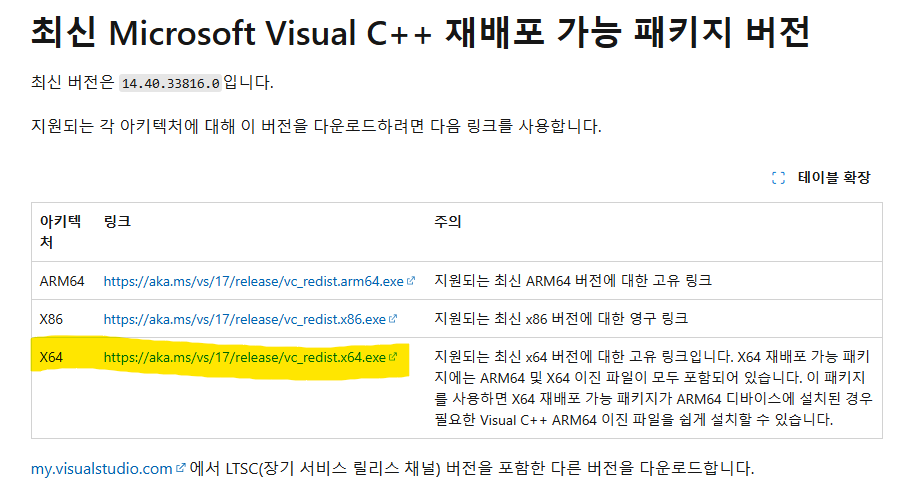
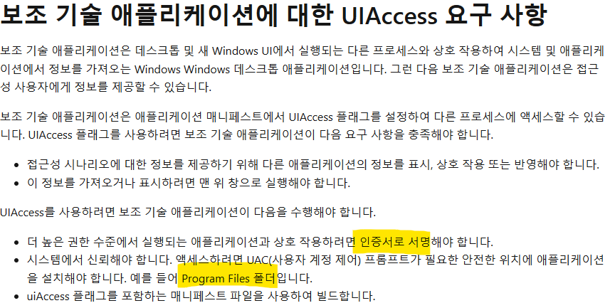

# HBOARD
## 설치
### 1. hboard.exe 파일을 다운로드 받는다.
### 2. Microsoft Visual C++ 재배포 가능 패키지 버전을 설치한다. 

[Microsoft Visual C++ 재배포 가능 패키지 최신 지원되는 다운로드]: https://learn.microsoft.com/ko-kr/cpp/windows/latest-supported-vc-redist?view=msvc-170#visual-studio-2015-2017-2019-and-2022

https://learn.microsoft.com/ko-kr/cpp/windows/latest-supported-vc-redist?view=msvc-170#visual-studio-2015-2017-2019-and-2022



### 3. "C:\Program Files" 폴더에 hboard 폴더를 생성 후 다운로드 한 파일을 넣는다.
**  주의 : 반드시 "C:\Program Files" 이어야 한다.**

### 4. 인증서를 설치한다. 순서는 다음과 같다.
   - hboard.exe를 마우스 오른쪽 클릭, 팝업 메뉴의 '속성' 선택 후 '디지털서명' 탭으로 이동한다.
   - HBOARD.LOCAL을 선택 후 "자세히" 버튼을 클릭한다. 
   - "인증서 보기" 버튼을 클릭한다.
   - "인증서 설치" 버튼을 클릭한다.
   - 저장소 위치에서 "로컬 컴퓨터" 항목을 선택한다.
   - "다음" 버튼을 클릭한다.
   - "모든 인증서를 다음 장소에 저장" 항목을 선택한다.
   - "찾아보기" 버튼을 클릭 후 "신뢰할 수 있는 루트 인증기관"을 선택한다.
   - "다음" 버튼 클릭, "마침" 버튼을 클릭하여 설치를 완료한다.
  

** 주의: 3과 4의 단계의 과정은 매우 중요하며 Windows Application의 중요 요구사항이다.**

[보조 기술 애플리케이션에 대한 UIAccess 요구 사항]:  https://learn.microsoft.com/ko-kr/windows/win32/WinAuto/uiauto-securityoverview#uiaccess-requirements-for-assistive-technology-applications

https://learn.microsoft.com/ko-kr/windows/win32/WinAuto/uiauto-securityoverview#uiaccess-requirements-for-assistive-technology-applications



## 실행

#### 팝업 매뉴 
```
마우스 오른쪽 
```

#### 핫키
```
Ctrl + Alt + H : 판서 모드 
Ctrl + Alt + Q : 판서 숨기기 
Ctrl + Alt + Z : 프로그램 종료
Ctrl + .  : 스크린 줌 인
Ctrl + ,  : 스크린 줌 아웃
Ctrl + /  : 스크린 줌 초기화
Ctrl + Shift + S : 스크린 캡쳐
```

#### 입력 단축키
```
A,D,W,S : 드로잉 모드로 동작 ( A,D : 기본 팬, W,S : 마커팬 )
A,D : 기본 팬의 색상을 변경(A 이후, D 이전)
W,S : 마커 팬의 색상을 변경(W 이후, S 이전)
1~9 : 팬의 굵기 지정
` : 팬의 기본 굵기 지정		

R : 클립 모드로 동작 
T : 텍스트 입력 ( Ctrl + Enter )
Ctrl + Shift + S : 스크린 캡쳐
```

#### 편집 단축키
```
Ctrl + A : 전체 선택
Ctrl + X : 잘라내기 
Ctrl + C : 복사
Ctrl + G : 병합
Ctrl + Shift + G : 병합해제
Ctrl + Z : 되돌기기(undo)
Ctrl + Shift + Z : 되살리기(redo)
Ctrl + Y : 되살리기(redo)
Ctrl + V : 클립보드의 내용을 화면에 붙인다. ( Text , Image, Shape )
Ctrl + E : 선택된 Shape 삭제
Delete : 선택된 Shape 삭제
Ctrl + Shift + E : 클리어 ( 삭제 내용 복구 불가 )
Ctrl + F : 앞으로
Ctrl + Shift + F : 맨앞으로
Ctrl + B : 뒤로
Ctrl + Shift + B : 맨뒤로
Ctrl + Q : 잠금
Ctrl + Shift + Q : 잠금 해제
Ctrl + Shift + 크기조정 : 비율을 맞추어 Shape를 조정한다. 
클립 모드 + Mouse Wheel : 선택된 Shape가 회전한다.
```

#### 환경 설정 단축키
```
Ctrl + F1 : 환경 설정 상자
```

#### 컨트롤 박스 단축키
```
F1 : 기본 컨트롤 박스
F2 : 편집 컨트롤 박스
F3 : 도형 도구 상자
```

#### 줌 단축키
```
Ctrl + 마우스 스크롤 : 스크린 줌/아웃
Ctrl + .  : 스크린 줌 인
Ctrl + ,  : 스크린 줌 아웃
Ctrl + /  : 스크린 줌 초기화
```

#### 페이지 단축키
```
Ctrl + Insert : 페이지 추가
Ctrl + Delete : 페이지 삭제
Ctrl + 1~9 : 페이지 추가
Ctrl + `  : 기본 페이지 추가
Ctrl + Tab : 페이지 보기 ( 페이지 이동/선택, 연속으로 Ctrl +  Tab )
Home : 첫 페이지로 이동
End  : 마지막 페이지로 이동
PageUp : 이전 페이지로 이동
PageDown : 다음 페이지로 이동
Tab : 다음 페이지 
Shift + Tab : 이전 페이지
```
